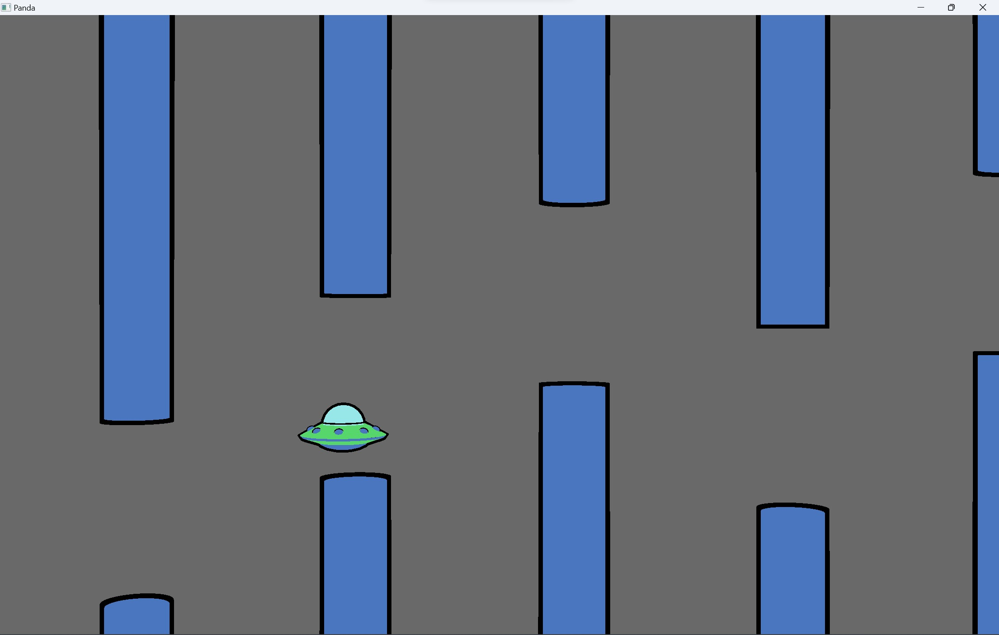
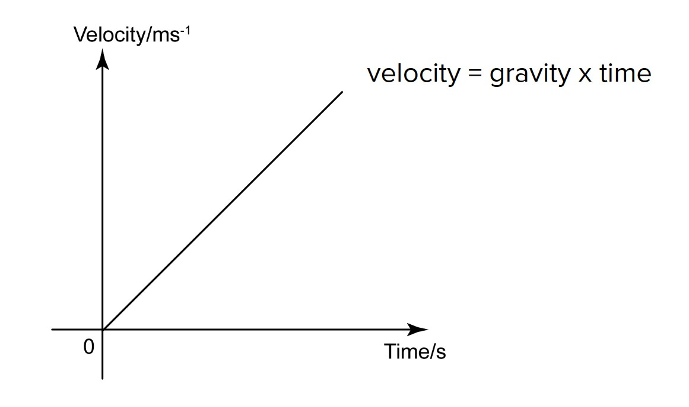
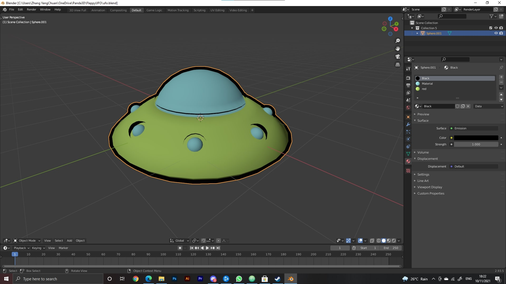

# FlappyUFO
A flappy bird game created using python and Panda3D framework.  
  


## Technologies Used
1. Python (Programming language)
2. Panda3D (3D framework)
3. Blender (3D modeling software)

## Designs
1. **Falling physics**
- Falling physics is done using a linear function where velocity is directly proportional to time.  
- Proportionality can be adjusted using 'gravity' variable.  
```
dt = globalClock.getDt() // Get the time value
self.velocityZ += self.gravity * dt // Falling equation
self.ufo.setPos(self.ufo.getPos() + Vec3(0, 0, self.velocityZ * dt)) // Update position of the UFO
```


2. **Jumping physics**
- Jumping physics is done using the following equation.  
- Jump height can be adjusted using  'jumpHeight' variable.
```
dt = globalClock.getDt() // Get the time value
self.velocityZ = math.sqrt(self.jumpHeight * -self.gravity) // Jump velocity equation
self.ufo.setPos(self.ufo.getPos() + Vec3(0, 0, self.velocityZ * dt)) // Update position of the UFO
```


3. **Generating pipes**
- The game initiate with 5 pipes of random heights at the beginning and generates more pipes as the UFO(player) moves to the right.  
- At every certain interval, the game will generate 1 extra pipe of a random height.
```
if self.ufo.getPos() >= self.checkpoint: // A check point is used between every interval
  self.pipeNumber += 1 // Add a new pipe once a check point is reached
  self.checkpoint += self.interval // Update the checkpoint to the next interval
  placeholder = render.attachNewNode("pipe-placeholder")
  placeholder.setPos(28 + self.pipeNumber * 7, 0, randrange(-5, 5)) // Generate a new pipe at a fixed distance away from the UFO(player)
  self.pipes.instanceTo(placeholder)
```

4. **3D models**
- The 3D models in the game is created using Blender.   
  
  


## How to install FlappyUFO
Step 1: Download Flappy UFO-0.0.0_win_amd64.zip.  
Step 2: Unzip and run Flappy UFO.exe under Flappy UFO folder.  

## How to play
- Click to jump.
- Close and open the program to restart the game.

## How to run FlappyUFO locally
Step 1: Install the latest version of Python 
Step 2: Install Panda3D package  
```
pip install panda3d
```
Step 3: Run FlappyUFO.py
